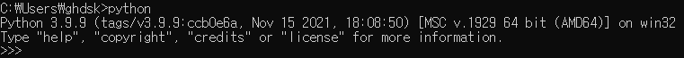
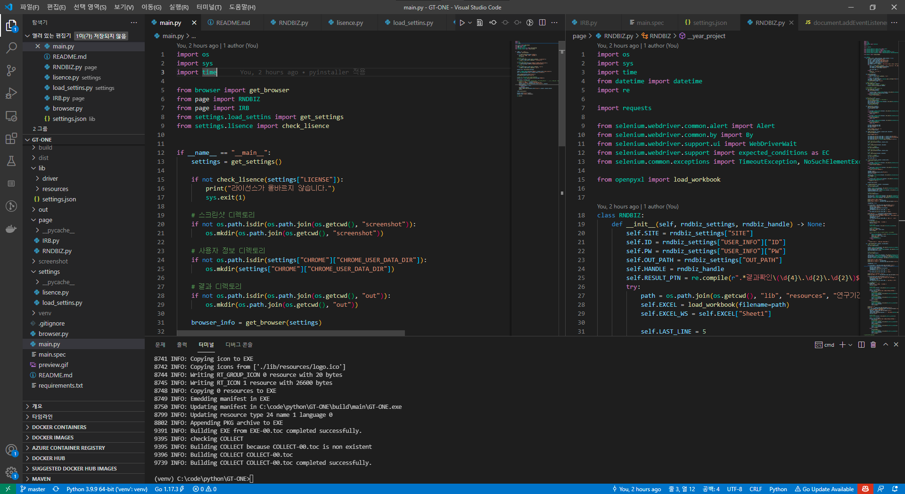
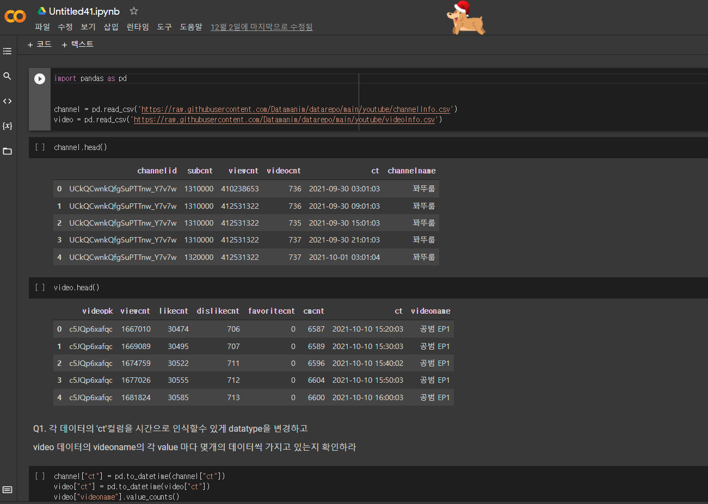
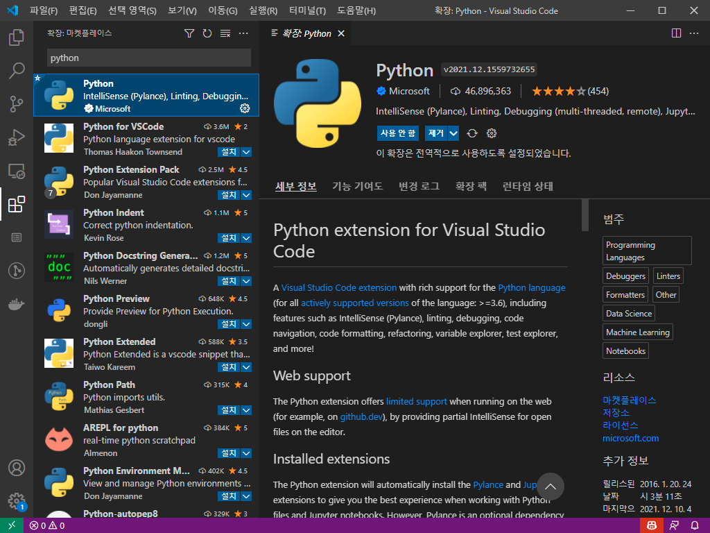
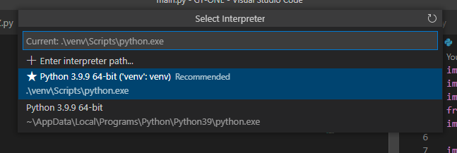
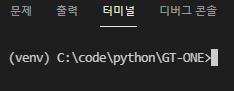

## 1. 개발 환경 구성
- 파이썬은 다양한 환경에서 개발이 가능합니다.
    1. Interpreter 환경에서 개발
        - 개발 도구와 대화 하듯 한줄 한줄 입력하며 결과를 확인할 수 있습니다.
        

    2. IDE 환경에서 개발
        - VSCode, Pycharm 등 IDE 등에서 파이썬 파일을 작성하여 개발할 수 있습니다.
        

    3. Jupyter Notebook 환경에서 개발
        - 셀 단위로 명령을 수행할 수 있으며 데이터 분석 및 시각화 등에 자주 사용합니다.
        

- 일반적으로 IDE 환경에서의 개발을 가장 많이 접하게 되므로, IDE 환경에서 개발하는 방법을 다룹니다.

### 1.1. 기본 환경 구성
- 파이썬을 이용하기 위해서는 파이썬을 설치해야 합니다.
- 파이썬은 [여기](https://www.python.org/downloads/windows/)에서 적절한 버전을 설치할 수 있습니다.
- 너무 최신버전을 사용하면 내가 이용하고자 하는 라이브러리에서 호환이 원활하지 않을 수 있습니다.
- 파이썬을 설치할 때는 Add path 옵션을 체크하도록 합니다.

### 1.2. 파이썬 실행
- 파이썬이 설치되면 CMD, PowerShell 등에서 `python` 혹은 `python3` 명령으로 실행할 수 있습니다.
- 만약 파이썬을 설치했는데 실행되지 않고 MS Store로 넘어간다면 환경변수를 추가해 주시기 바랍니다.
- 아래와 같이 파이썬 버전과 함께 파이썬이 실행된다면 정상적으로 파이썬을 이용할 수 있게 됩니다.

    

### 1.3. 개발 툴
- 파이썬은 다른 언어와 마찬가지로 메모장으로도 개발이 가능합니다.
- 하지만 다른 언어와 마찬가지로 IDE 또는 전문 에디터를 사용하면 생산성이 올라가고 편리합니다.
- 본 문서에서는 `vscode`를 이용하여 개발을 진행합니다.
- vscode는 [여기](https://code.visualstudio.com/)에서 다운받을 수 있습니다.
- vscode를 설치 후 좌측에 확장(Extension) 탭에서 `python`을 검색 후 설치합니다.

### 1.4. 파이썬 가상환경
- 파이썬은 일반적으로 `pip` 라는 툴을 이용하여 `의존성 관리`를 합니다.
- `pip install <패키지명>`과 같은 방식으로 새로운 패키지 설치가 가능합니다.
- 하지만 프로젝트마다 필요한 패키지의 종류와 버전이 다를 수 있기 때문에 프로젝트별 의존성 관리가 필요하게 됩니다.
- 이때 파이썬은 가상환경이라는 것을 사용합니다.

### 1.4.1. venv
- 파이썬에는 `venv`라는 모듈이 존재하며, 이를 통해 파이썬 가상환경을 구축할 수 있습니다.
- `python -m venv <가상환명 이름>` 명령어로 사용하며, `-m`은 모듈 옵션입니다.
- 보통 가상환경 이름도 `venv`로 사용하기 때문에 `python -m venv venv` 명령을 이용합니다.
- 프로젝트를 시작하기 원하는 경로에서 `python -m venv venv`를 입력하면 venv라는 디렉토리가 생성됩니다.

### 1.5 VSCODE
- vscode의 `파일 - 폴더 열기`를 통해 프로젝트 폴더를 선택하고 엽니다.
- 만약 python과 관련된 확장을 설치하려 할 경우 동의하고 설치합니다.
- 이후 `F1`을 클릭하고 `>Python: Select Interpreter`와 같이 입력하면 다음과 같이 파이썬을 실핼할 인터프리터 목록을 확인할 수 있습니다.

- 여기서 우리가 생성한 `venv`(경로 주의)를 선택합니다.
- 이후 `터미널 - 새 터미널`을 클릭하면 아래 그림과 같이 명령 프롬프트 앞에 (venv)가 생기는 것을 확인할 수 있습니다.
- 만약 에러가 발생하면 터미널 우측에 `powershell`로 선택되어있지 않은지 확인하고 `cmd`를 선택하도록 합니다.(powershell도 설정을 변경하면 이용이 가능하지만 여기서는 다루지 않습니다.)
