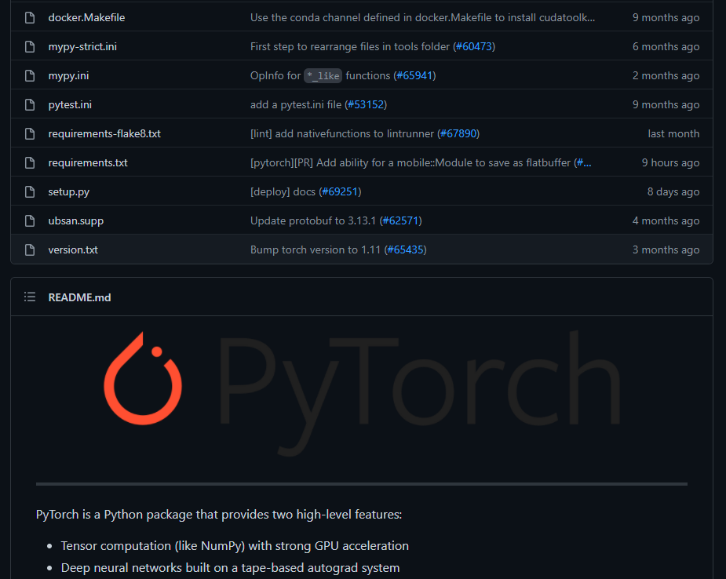

# 3. 자주 사용하거나 유용한 기능

## 3.1. pip
- 파이썬은 pip를 통해 패키지를 설치할 수 있습니다.
- pip는 `python -m pip` 혹은 `pip` 명령으로 사용할 수 있습니다.
- `pip install <패키지명>`으로 설치가 가능합니다.
- 패키지는 [`pypi`](https://pypi.org/)에서 확인 가능합니다.

### 3.1.1. requirements.txt
- 파이썬 라이브러리를 검색하다 보면 다음과 같이 `requirements.txt`같은 파일이 포함되어 있는 것을 확인할 수 있습니다.

- 파이썬은 pip를 통해 해당 파일에 있는 패키지를 한번에 설치할 수 있는 기능을 제공합니다.
- `pip install -r requirements.txt` 명령을 통해 해당 파일 내에 있는 패키지를 모두 설치할 수 있습니다.

## 3.2. main 모듈
- 파이썬은 기본적으로 main 없이도 잘 작동합니다.
- 하지만 종종 main을 작성해야할 상황이 생깁니다.
- 하나의 python 파일이 직접 실행되기도 하고, 다른 프로그램의 모듈로도 사용되는 프로그램을 만들고 싶을 수 있습니다.
- `if __name__ == "__main__":` 구문을 이용하여 main을 나타낼 수 있습니다.
    ```python
    # myModule.py

    import os
    
    def getPath():
        return os.getcwd()

    # main 모듈일 경우에만 작동
    if __name__ == "__main__":
        print(getPath())
    ```